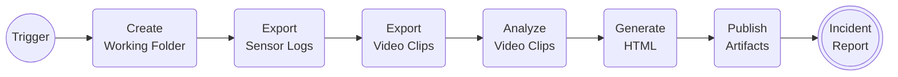
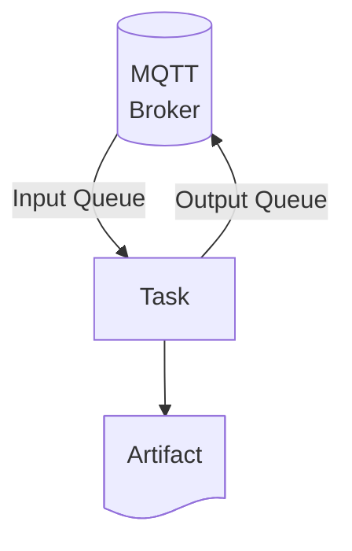

# Speed Trap
**⚠️ This is a work in progress. ⚠️**  

## Overview
Speed Trap is a solution I'm working on that automatically produces
and publishes incident reports that can be used as evidence of 
illicit activity.  It does so by pulling data from various sources
and compiling them into simple HTML pages.

## Technology
Speed Trap is a solution written in Python that uses an MQTT Broker as 
a lightweight message queue to coordinate a series of tasks.  Specifically
it's built around the [Eclipse Mosquitto™](https://mosquitto.org/) MQTT Broker built
into [Home Assistant](https://www.home-assistant.io/), 
[Unifi Protect](https://www.ui.com/camera-security), and a 
[Hi-Link HLK-LD2415H velocity radar sensor](https://www.hlktech.net/index.php?id=1219) 
using a [custom component](https://github.com/cptskippy/esphome.ld2415h) 
for [ESPHome](https://esphome.io/).

### Dependencies
* [Unofficial UniFi Protect Python API and CLI](https://github.com/uilibs/uiprotect)
* [Eclipse Paho™ MQTT Python Client](https://github.com/eclipse-paho/paho.mqtt.python)

### Assumptions
* A working MQTT Broker
* A Unifi Protect server with one or more cameras
* A working Home Assistant
* A speed sensor in Home Assistant

## Philosophy
This solution is primarily a journey to further my understanding of Python 
and Linux. The code is intentionally simple and easy to understand using 
patterns that aid experimentation and debugging. It will sacrifice 
performance and efficiency for the sake of simplicity. Where possible it 
will be robust and reliable but focus on repeatability and recoverability.

## Architecture
The solution executes a simple process flow where each task is completed sequentially.



Each task uses the Pub/Sub Pattern to trigger it's execute and publish results to an
output queue that triggers the next task in the process.


## Repository Structure
```bash
  speed-trap/
  ├── config/  # project configuration
  │   └── config.yml
  ├── docker/  # docker container definitions
  │   ├── .dockerignore
  │   ├── docker-compose.yml
  │   └── Dockerfile
  ├── scripts/  # docker build and run scripts
  │   ├── build.sh
  │   └── run.sh
  ├── shared/  # shared modules or helper classes
  │   └── *.py
  ├── .env  # secrets
  ├── .gitignore
  ├── requirements.txt  # python dependencies
  └── task_*.py  # pub/sub tasks monitiring queues
```

## Task Overview
Below is a general overview of what each task is intended to do.  Some 
tasks are fully functional while others have no implementation or simply 
do not exist.  The Orchestration method for the tasks has not been 
established and will be developed in the future.

### task_folder_setup.py
Creates a working folder

### task_sensor_log_handler.py
Exports Home Assistant sensor logs to JSON

### task_video_clip_fetcher.py
Exports video clips from Unifi Protect to MPG files

### task_object_classifier.py
Analyze videos using OpenCV and extracts images and thumbnails

### task_report_publisher.py
Generates an HTML file, publishes artifacts, and sends notifcation of completion

## Motivation and Intent
The block I live on has nearly a dozen children under the age of 10 
and vehicles speeding down our short stretch of road present a hazard. 
The speed limit in our neighborhood is 15 mph but vehicles will race 
down our street at nearly double that limit. My intent is to reduce 
speeding in my neighborhood by cataloging activity, compiling 
individual incident reports, identifying repeat perpetrators, and 
building a body of evidence sufficient to compel the authorities 
to act.
